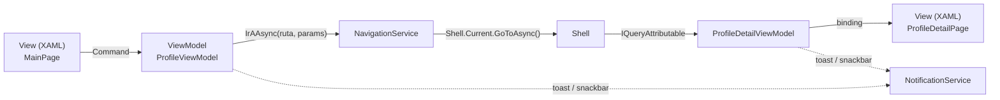
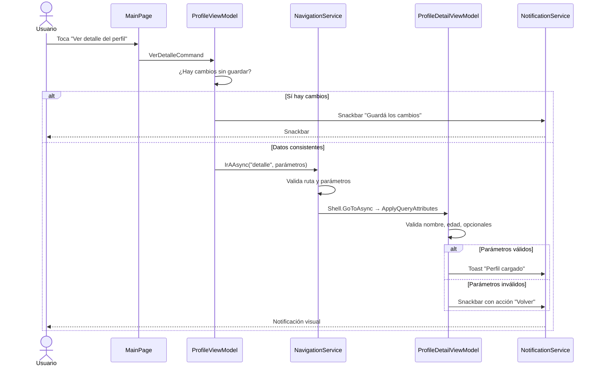

# Flujo de navegación — PerfilAlumno

## 1. Arquitectura

La navegación **no vive en las páginas**. Las View solo bindean un `Command`;
toda la decisión (validar, armar parámetros, avisar al usuario) ocurre en el
ViewModel, que habla con una abstracción `INavigationService`.

Ventaja: el ViewModel no conoce a `Shell`. Si mañana se cambia el motor de
navegación, solo se toca `NavigationService.cs`.

## 2. Rutas registradas

| Ruta | Página | Dónde se declara |
|---|---|---|
| `//MainPage` | `MainPage` | `ShellContent` en `AppShell.xaml` |
| `detalle` | `ProfileDetailPage` | `Routes.Registrar()` en `MauiProgram.cs` |

## 3. Recorrido paso a paso

## 4. Parámetros que viajan

Se envían como `IDictionary<string, object>` (objetos tipados, no strings en
la URL) y los nombres salen de constantes compartidas en `ParametrosPerfil`,
así el emisor y el receptor nunca se desincronizan.

| Parámetro | Tipo | Obligatorio | Validación en destino |
|---|---|---|---|
| `nombre` | `string` | Sí | presente y no vacío |
| `edad` | `int` | Sí | numérico, entre 1 y 119 |
| `descripcion` | `string` | No | si falta → "(sin descripción)" |
| `imagen` | `string` | No | si falta → imagen por defecto |

## 5. Validaciones en tres capas

1. **ViewModel de origen** — no navega si hay cambios sin guardar o el perfil
   está incompleto.
2. **NavigationService** — rechaza rutas vacías, claves sin nombre y valores
   nulos; captura la excepción de ruta no registrada y expone `UltimoError`.
3. **ViewModel de destino** — `ApplyQueryAttributes` valida presencia, tipo y
   rango de cada parámetro; si algo falla muestra la vista de error y ofrece
   volver.

## 6. Notificaciones visuales

| Situación | Tipo | Mensaje |
|---|---|---|
| Perfil guardado | Toast | "Perfil actualizado correctamente." |
| Validación de guardado fallida | Snackbar | motivo del error |
| Intento de navegar con cambios pendientes | Snackbar | "Guardá los cambios..." |
| Fallo de navegación | Snackbar | `UltimoError` del servicio |
| Detalle cargado | Toast | "Perfil de X cargado." |
| Parámetros inválidos | Snackbar + acción "Volver" | detalle de qué faltó |

> El `Toast` del CommunityToolkit todavía no funciona en Windows; el servicio
> lo detecta y cae a `Snackbar` para no perder el aviso.
